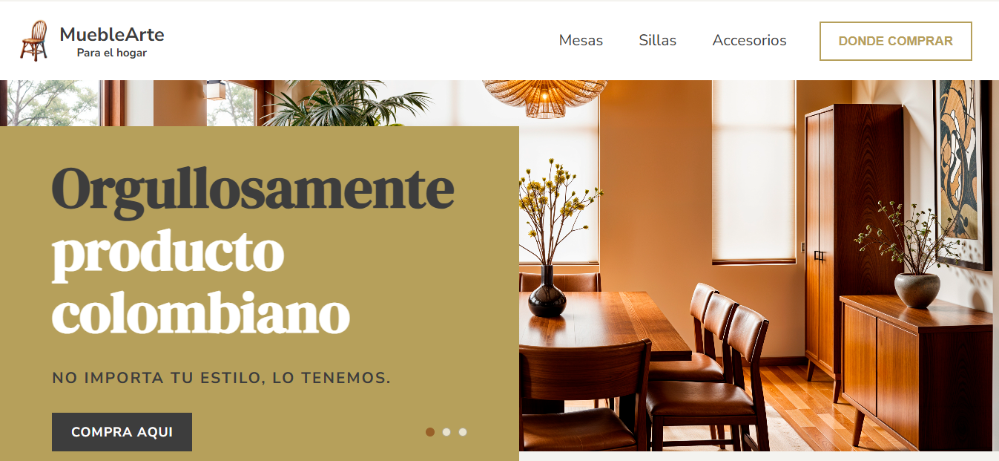

# Handmade Furniture Page

Website designed as a practice project in **React** to display a handmade furniture store. It includes navigation, informational sections, products organized by category (chairs, tables, sofas, accessories), and a responsive design.
---

## 🛠️ Technologies Used

- React.js
- React Router DOM
- HTML5 / CSS3
- JavaScript (ES6)
- Vite (as bundler)
- Custom images and styles

---

## 📁 Main Structure
```
src/
│
├── assets/..........# Site images
├── components/......# Reusable components (Header, Footer, Hero, etc.)
├── pages/...........# Main pages (Home, Chairs, Tables, etc.)
├── styles/..........# Global styles and buttons
├── data/............# Shared product data files
└── App.jsx..........# Main routes file

```

---

## 🚀 How to run locally

1. **Clone the repository:**
   ```bash
   git clone https://github.com/camilo-cloud/pagina-muebles.git
   ```

2. **Enter the folder**
   ```bash
   cd pagina-muebles
   ```

3. **Install the dependencies:**
   ```bash
   npm install
   ```

4. **Run the project:**
   ```bash
   npm run dev
   ```

5. **Open in the browser:**  
   Visita [http://localhost:5173](http://localhost:5173)

---

## 📌 Project Status

This site is under development as part of a learning process aimed at gaining hands-on experience with React and modern web design.

---

## 📷 Preview




---

## 📄 Licence

This project is free to use for educational and personal purposes.